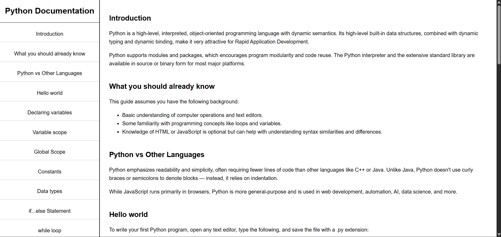

# 📆 2 August 2025 – Daily Dev Log

## 🧠 What I Learned Today  
- Structuring and styling a full-page technical documentation layout from scratch.
- Creating a fixed-height, scrollable sidebar using `position: fixed` and `overflow-y: auto`.
- Enhancing user experience with hover effects and clean section link navigation.
- Applying responsive design principles with media queries for mobile-friendliness.
- Understanding how freeCodeCamp validates projects and how to match `id`s in navigation.

## ✅ What I Did Today:

- Practiced building the **Technical Documentation Page** project as part of the freeCodeCamp [Responsive Web Design Certification](https://www.freecodecamp.org/learn/).
- Focused on sidebar layout, responsiveness, and spacing using modern CSS techniques.
- Made the layout flexible and readable across devices using **media queries**.
- Completed full structure and passed all **FCC tests** successfully.

## 🧩 Problems Faced  
- Sidebar looked cramped initially — fixed with `height: 100vh` and better padding.
- Faced mobile overflow issues — resolved using proper media queries.
- Minor mismatch in section `id`s vs. navbar links caused test failures.

## 🧪 Project Work:

A **practice build** of the "Technical Documentation Page" using HTML and CSS.  
This is **not the final version** — I will rebuild a more polished version later and push that to GitHub.

### 📸 Preview

### 📁 Files:

- `index.html` – Full structure of the documentation layout  
- `style.css` – Styling for layout, sidebar, responsiveness  
- `screenshot.png` – Screenshot of the current practice version

## 🔗 References:

- [freeCodeCamp – Responsive Web Design](https://www.freecodecamp.org/learn/)

---

> 💬 _"Discipline is choosing between what you want now and what you want most."_  
