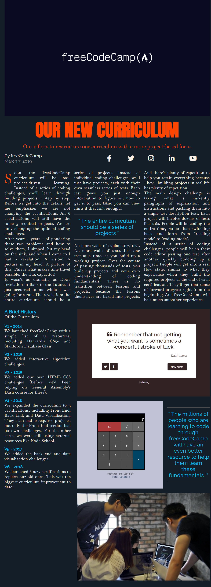

# 📆 19 August 2025 – Daily Dev Log

## ✅ What I Did Today:

- Completed the module **"Learn CSS Grid by Building a Magazine"** on freeCodeCamp.  
- Got hands-on with CSS Grid properties and layout building.  
- Understood the basic structure but still unsure when to use specific properties like `auto-fit`, `fr`, etc.  
- Made a rough time management plan since my **Java Full Stack Course** starts tomorrow.  
- Productivity wasn't at peak today due to constant rain and lazy energy.

## 🧪 Project Work:

A **magazine layout** built using **HTML and CSS Grid**, focusing on grid concepts like rows, columns, areas, and layout alignment.

This project helped build foundational understanding of Grid — although still in learning mode, not mastery.

### 📸 Preview

  

### 📁 Files:

- `index.html` – Magazine content and structure  
- `style.css` – Styling using CSS Grid layout  
- `screenshot.png` – Screenshot of final output

## 🧩 Problems Faced:

- Couldn't understand when to use `auto-fit` vs `auto-fill`.  
- Unsure of how to approach a layout from scratch using Grid without external reference.  
- Day wasn’t productive overall due to the weather and scattered focus.

## 🔥 Plan for Tomorrow:

- Attend **Day 1 of Java Full Stack Course**  
- Create a mini log/notes for whatever is taught  
- Try to complete the RWD asap and build projects
- If time allows: Continue next module on FCC  
- Start organizing time slots for both course + self-learning

## 💬 Quote of the Day:

_"Slow progress is better than no progress. Stay consistent."_
