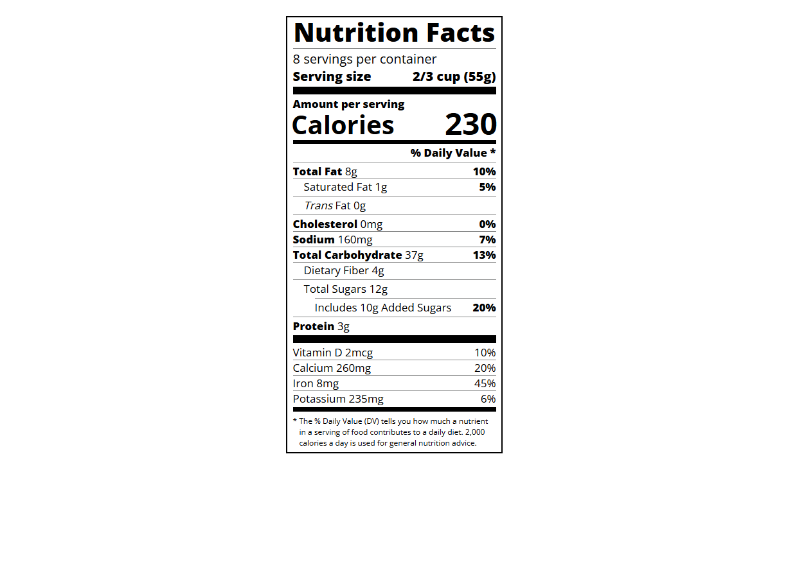

# 📆 27 July 2025 – Daily Dev Log

## ✅ What I Did Today:

- Continued learning **HTML & CSS** as part of the freeCodeCamp [Responsive Web Design Certification](https://www.freecodecamp.org/learn/).
- Completed a new CSS module** on freeCodeCamp.
- Followed the **CSS tutorial from Apna College (YouTube)** to strengthen fundamentals.
- Worked on a **project-based exercise** focused on:
  - Semantic HTML
  - Nesting `span` elements for layout/alignment
  - Applying CSS classes like `bold`, `right`, `no-divider`

## 🧪 Project Work:

A practice component from the "Nutrition Label" challenge using HTML and CSS.  
Preview available below 👇

### 📸 Preview

### 📁 Files:

- `index.html` – Markup for the label structure
- `styles.css` – Styling for layout and formatting
- `screenshot.png` – Screenshot of completed layout

## 🔗 References:

- [freeCodeCamp – Responsive Web Design](https://www.freecodecamp.org/learn/)
- [Apna College – CSS Tutorial on YouTube](https://www.youtube.com/watch?v=ESnrn1kAD4E)

---

> 💬 _"One day or day one. You decide."_  
