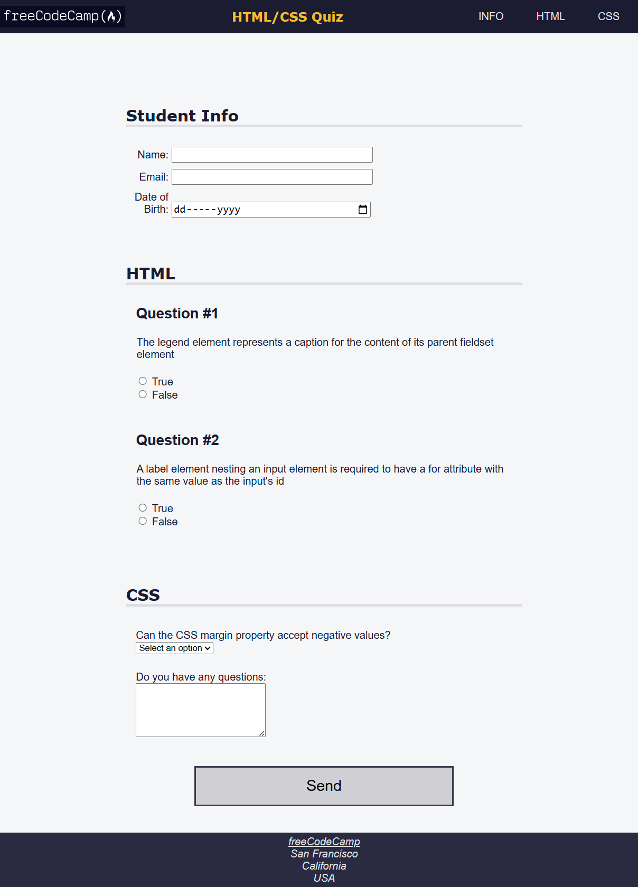

# 📆 28 July 2025 – Daily Dev Log

## ✅ What I Did Today:

- Completed the **"Learn Accessibility by Building a Quiz"** module on [freeCodeCamp](https://www.freecodecamp.org/learn/).
- Watched the **CSS tutorial from Apna College (YouTube)** to deepen styling skills.
- Took notes and practiced concepts like font units, borders, padding, and centering.
- Started working on the **Tribute Page project** on freeCodeCamp.
- Also began creating a **personal tribute page** as additional practice

## 🧪 Project Work:

A practice component from the "Building a Quiz" challenge using HTML and CSS.  
Preview available below 👇

### 📸 Preview

### 📁 Files:

- `index.html` – Markup for the label structure
- `styles.css` – Styling for layout and formatting
- `screenshot.png` – Screenshot of completed layout

## 🔗 References:

- [freeCodeCamp – Responsive Web Design](https://www.freecodecamp.org/learn/)
- [Apna College – CSS Tutorial on YouTube](https://www.youtube.com/watch?v=ESnrn1kAD4E)

---

> 💬 "Great things are not done by impulse, but by a series of small things brought together." 
– Vincent Van Gogh