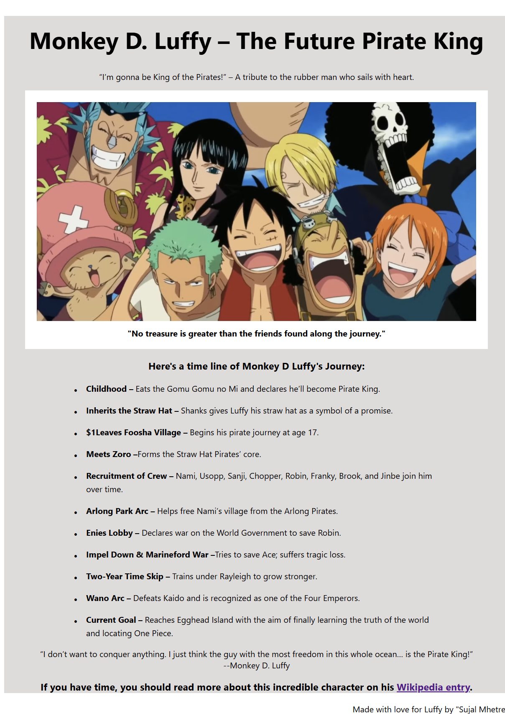

# 📆 29 July 2025 – Daily Dev Log

## ✅ What I Did Today:

- Took a light day due to feeling unwell — focused on rest and recovery.
- Completed the **Tribute Page project** on [freeCodeCamp](https://www.freecodecamp.org/learn/).
- Watched a few **developer podcasts and CSS tutorials** to stay mentally engaged.
- **Pushed Tribute Page project to GitHub** as part of my Responsive Web Design work.

## 🧪 Project Work:

Final version of the **Tribute Page**, built with HTML and CSS as part of the freeCodeCamp certification.  
Preview available below 👇

### 📸 Preview

### 📁 Files:

- `index.html` – Page structure and tribute content  
- `styles.css` – Styling for layout and timeline  
- `screenshot.png` – Final screenshot of project  

## 🔗 References:

- [freeCodeCamp – Responsive Web Design](https://www.freecodecamp.org/learn/)
- [Apna College – CSS Tutorial](https://www.youtube.com/watch?v=ESnrn1kAD4E)

---

> 💬 "Some days you just need rest. Progress isn’t always loud — showing up still counts."  
> – You today
