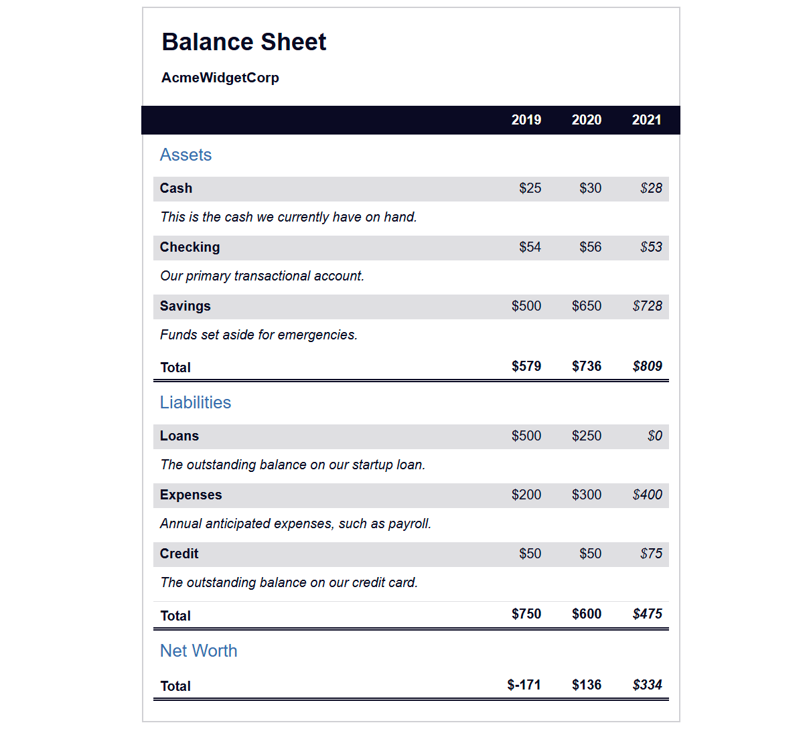
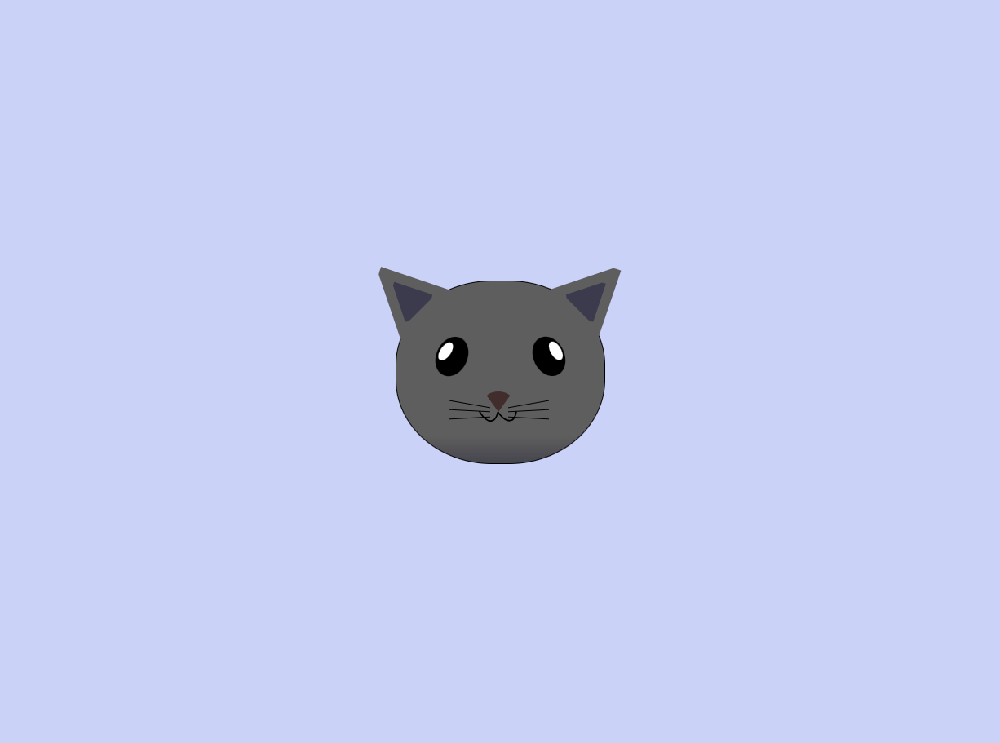
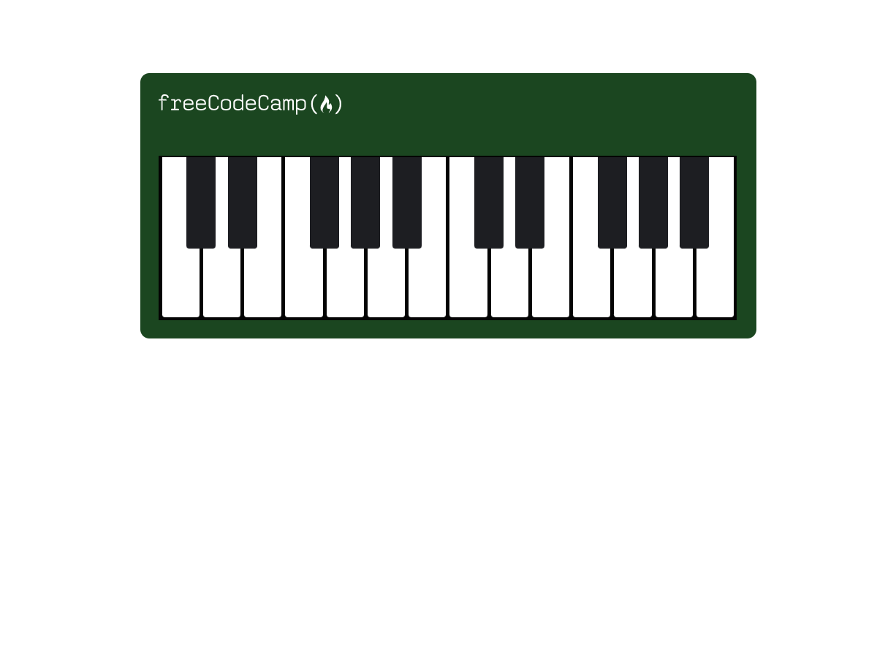

# 📆 30 July 2025 – Daily Dev Log

## ✅ What I Did Today:

- Continued my Responsive Web Design journey on [freeCodeCamp](https://www.freecodecamp.org/learn/)
- Completed **3 module-based mini projects**:
  - 🧾 Balance Sheet
  - 🎨 Cat Painting
  - 🎹 Piano
- Pushed all projects with screenshots and code files to the [daily-dev-log GitHub repo](https://github.com/your-username/daily-dev-log)

## 🧪 Module Work:

### 🧾 Balance Sheet

Basic layout structure using semantic HTML and CSS Grid.

#### 📸 Preview

#### 📁 Files:

- `index.html` – HTML structure  
- `styles.css` – CSS layout using Grid  
- `screenshot.png` – Project screenshot

---

### 🎨 Cat Painting

Explored the use of CSS positioning to "paint" a cat using only `div`s and styles.

#### 📸 Preview

#### 📁 Files:

- `index.html` – HTML elements for each cat part  
- `styles.css` – Styling with `position`, `background-color`, and borders  
- `screenshot.png` – Final cat render

---

### 🎹 Piano

Practiced Flexbox by building a horizontal piano layout with interactive keys.

#### 📸 Preview

#### 📁 Files:

- `index.html` – Piano key structure  
- `styles.css` – Flexbox styling and hover effects  
- `screenshot.png` – Project output

---

## 🔗 References:

- [freeCodeCamp – Responsive Web Design](https://www.freecodecamp.org/learn/)
- [Apna College – CSS Tutorial](https://www.youtube.com/watch?v=ESnrn1kAD4E)

---

> 💬 “Consistency compounds. Stack days, not perfection.”
